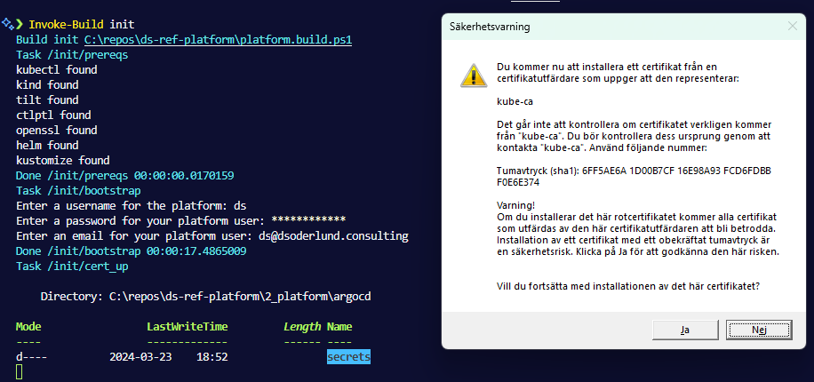
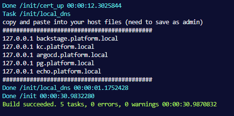
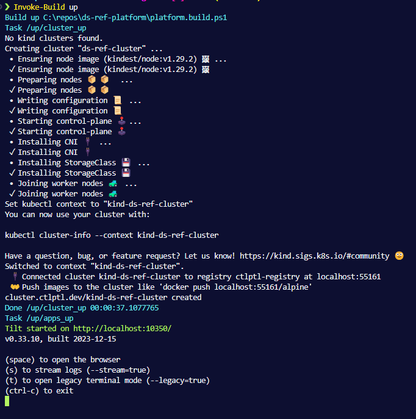
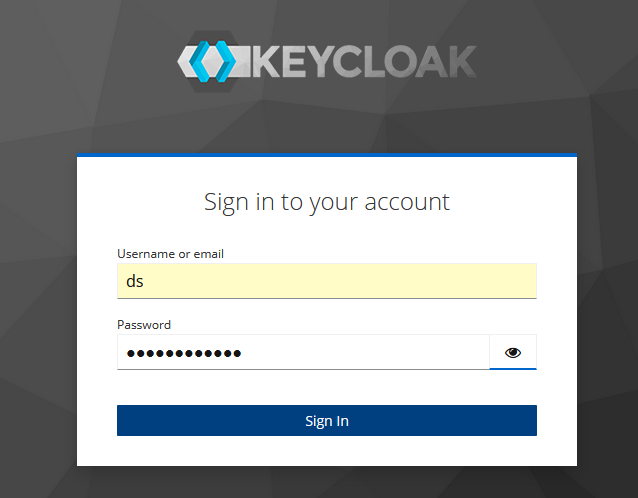
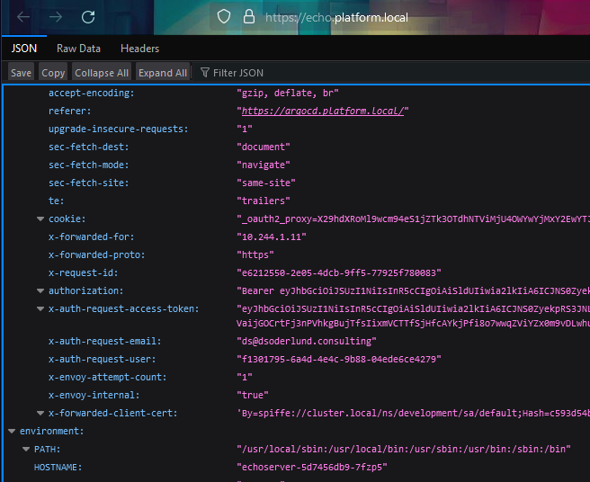

# David Söderlunds Reference Platform

Try out identity and access management and gitops quickly.

The goal of this repo is to showcase free and open source software that plays nicely together in kubernetes and to allow you to quickly get up and developing cloud native apps.

## Setup

``` PowerShell
Install-Module InvokeBuild
Invoke-Build init
Invoke-Build up
```

## Prerequisites

### Part 0, powershell and cert creation

- PowerShell
- InvokeBuild
- openssl

### Part 1, kubernetes

- kubectl
- kind
- ctlptl

### Part 2, platform

- kustomize
- helm
- tilt

## Ew, its all in windows or something?

Yes, I haven't switched to linux on my daily driver. There is a gap in the market for platform engineers who know windows well for consulting companies that run a lot of windows and enterprise software.

Please send me a PR with the entire setup natively on linux.

## OK, so what does this do?

1. It lets you bootstrap a local kubernetes cluster with little know how and few prerequisites.

2. It lets you deploy resources for practicing platform engineering with simple configuration.

3. It lets you onboard your git repo as a source of truth for applications and other infrastructure.

## How does this work?

When `init` runs it will check the prereqs, ask you for your prefered username, password and email. Those credentials will be stored locally in plaintext so please don't reuse passwords.
A new root cert will be generated and you will be prompted to install it on your system.

Lastly it will prompt you to add the dns records to your hostfile in order for you to be able to resolve and access the services through the istio ingress gateway using the dns names defined in the project.




When `up` runs it will create a 1 worker 1 control-plane cluster using kind on docker desktop according to the spec in `1_cluster/kind/cluster.yaml`.

Then it will run the tiltfile `4_crossplane_\Tiltfile` to get the platform and then the gitops configuration for apps and infrastructure up.



So once all of this has had the time to run through you can checkout an app that gets deployed:

https://echo.platform.local/

First you need to logon to keycloak though with those credentials you specified.



How exciting, this app will echo the request as it is sent.



You can view the echo apps defintion through argocd: https://argocd.platform.local/applications/argocd/echo

Notice that you didn't log on but argocd still knows who you are and it knows to give you access.

You can check out your user settings here: https://argocd.platform.local/user-info

## Right, but how did we go from "up" to this app running?

The platform contains

- istio (service mesh and routing, like if linkerd and traeffik had a baby)
- keycloak (identity and access management, local users management, federation, brokerage)
- oauth2proxy (can act as an api gateway, and lets us deploy apps in our platform that get single sign on and stuff for free)
- postgres (got to run those databases somewhere, you can switch this out easily but its here to not leave any gaps)
- argocd (gitops tool with a kick as ui, can sync desired state of any thing kubernetes native to one or more clusters)
- crossplane (turn your cluster in-side-out, why just use the best api and distributed storage ever invented to manage containers? Lets kubernetes be the control plane of anything)

## I don't need help setting up a local kubernetes cluster

Awesome, skip that step and move on to the platform resources. Let me know how you did it.

## I don't like tool_x

Substitute your own! Share your experience.

## I don't need all of this

Ignore it or comment it out of the respective kustomization.yaml and tiltfile to skip deploying it.

## Hey you are obviously missing tool_y

Yes, obviously. Nice catch, please send a PR that includes and explains it for everyone.

## I am in, you said something about gitops?

Apps will be deployed by default from the gitops-apps application set defined in `3_gitops\appsets\gitops-apps.yaml`
By default this is the service echo which will help you debug the requests that are sent to service upstream from oauth2proxy.
You can point this appset to deploy apps from some other repo/branch than this to get your apps or you can deploy something else entirely with `3_gitops\Tiltfile` which creates it.

## And infrastructure as data?

Infrastructure can be deployed through kubernetes since we have equipped it with crossplane. You need to add the providers and their credentials as you need, but there is one out of the box for keycloak for you to play with.

You can check out the app that managed keycloak resources here: https://argocd.platform.local/applications/argocd/crossplane-keycloak

[Read more about crossplane in this platform.](crossplane.md)


## Roadmap!

I am looking forward to adding more tools to test out together.

- hello world app (...I'm not very good with frontend. It lets you experience developing on top of tilt with hot reload while in a kubernetes cluster)
- kyverno (policies for who can do what and how things should behave)
- kubevirt (for when your platform needs to support virtual machines)
- vault (secrets management)
