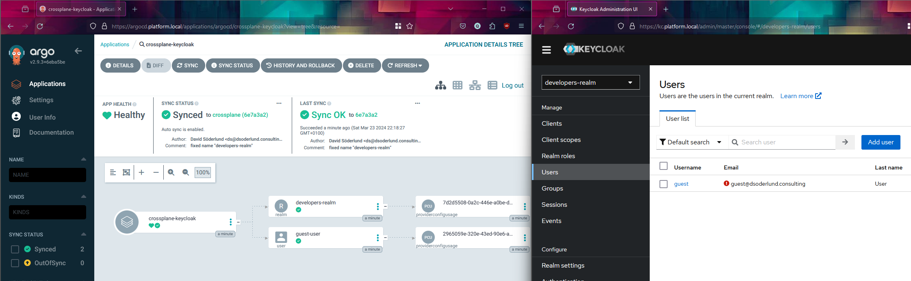

# Why crossplane

Crossplane allows your kubernetes cluster to import "providers" which become operators that manage resources outside of kubernetes itself.

A popular use case is to manage cloud infrastructure such as azure or aws.

It is very powerful compared to terraform since it uses kubernetes as its control plane. A lot of the providers in the crossplane ecosystem are built from terraform modules using upjet (formerly terrajet).

The operators that get created can be thought of as terraform modules which continuously try to reach the desired state.

## By the power of gitops

Instead of writing code for our infrastructure and applying it, we can let argocd sync it for us. That way the state of our infrastructure is kept in the same way as the state of our applications.
We can also start to tie them together with kustomize, or with crossplane composite resource defintions (XRDs). For example creating a defintion of a "backend app" which is not just a deployment or statefulset and so on but also the actual database and the secret for its connectionstring all rolled into one.

### Dealing with CRD dependencies

There is one final piece of the puzzle that needs to be dealt with, and that is that even if desired state is the name of the game, tilt still tries to push our stuff and being surprised that CRDs are missing.

By having the crossplane provider as an application through gitops we can control the dependencies on CRDs in a way that tilt isn't really built for.

To do it we use sync-waves.

We create the provider first by giving it a value of -2 and wait for it to finish before we sync the provider configuration which gets -1. The provider configuration is dependent on the provider setting up its CRD.

To make sure that argocd doesn't fail during dryrun of all resources for missing CRDs we also need to add the annotation `argocd.argoproj.io/sync-options: SkipDryRunOnMissingResource=true`

Then the rest of our stuff will sync, since no sync-wave is 0.

### Desired state infrastructure as data.

Now we can start to configure our infrastructure (or what ever it might be) with kubernetes native yaml, for example through a keycloak provider we can add realms or users or what ever to our platform.

