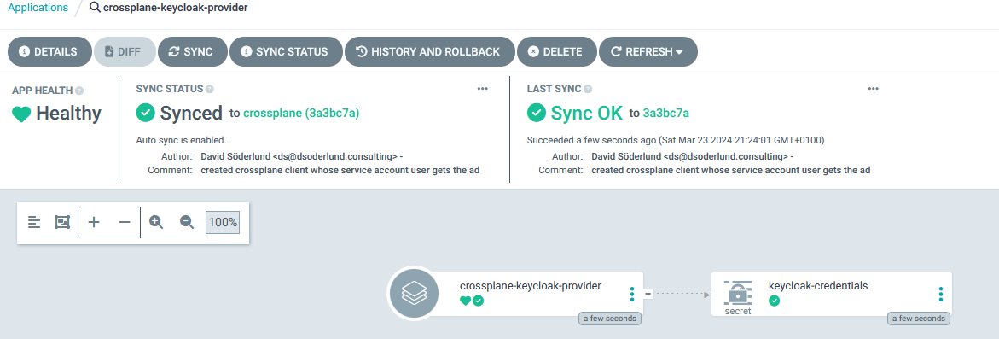

By having the crossplane provider as an application through gitops we can control the dependencies on CRDs in a way that tilt isn't really built for.

To do it we use syncwaves.

First the credentials that crossplane will use to connect to keycloak will show up.

Then we create the provider and wait for it to finish before we sync the provider configuration (which is dependent on the provider setting up its CRD)

