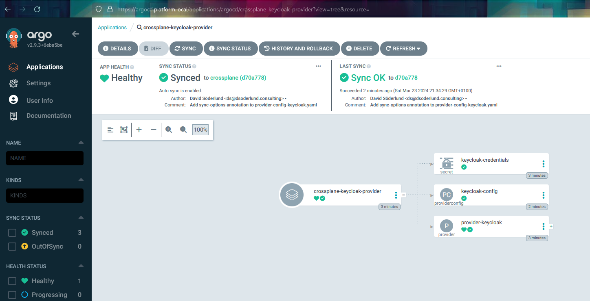

By having the crossplane provider as an application through gitops we can control the dependencies on CRDs in a way that tilt isn't really built for.

To do it we use sync-waves.

We create the provider first by giving it a value of -2 and wait for it to finish before we sync the provider configuration which gets -1. The provider configuration is dependent on the provider setting up its CRD.

To make sure that argocd doesn't fail during dryrun of all resources for missing CRDs we also need to add the annotation `argocd.argoproj.io/sync-options: SkipDryRunOnMissingResource=true`

Then the rest of our stuff will sync, since no sync-wave is 0.